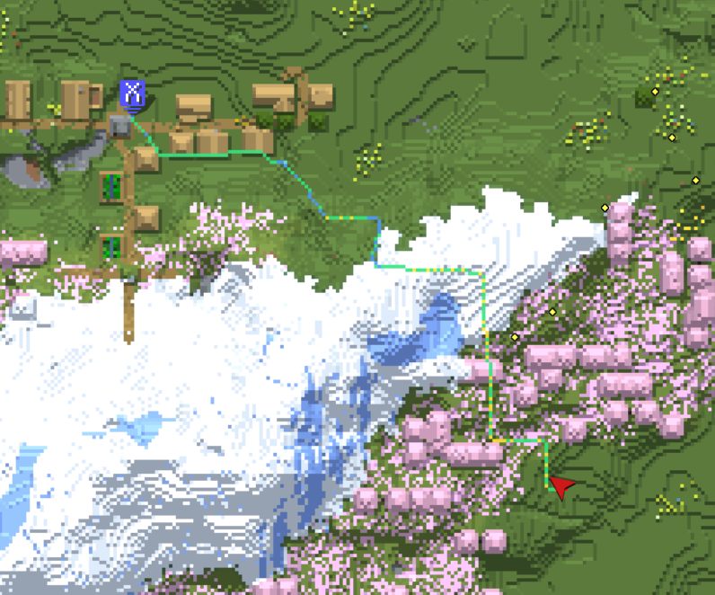
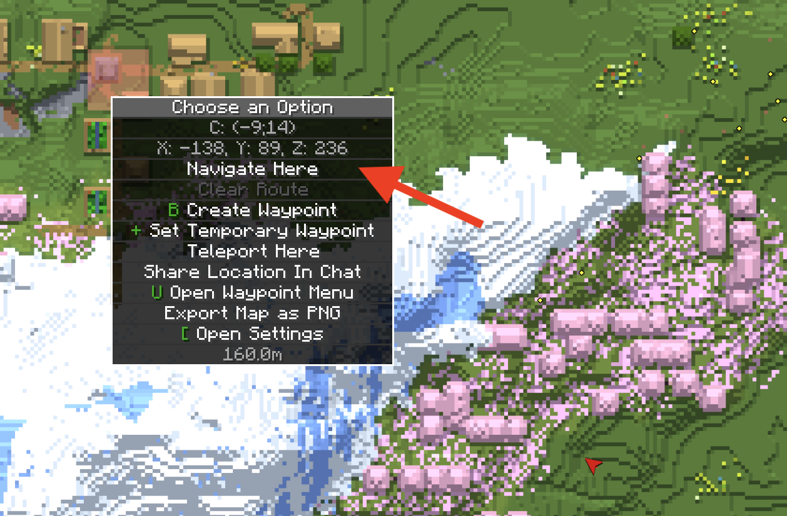

# XaeroNav

English | [日本語](README.ja.md)

A client-side Minecraft mod that finds a route you can actually walk to a destination, then draws
it in the world, on Xaero's World Map, and on Xaero's Minimap. The top of the screen tells you
where to go next.

- Minecraft 1.21.1, NeoForge 21.1.228 or newer
- Client-only. Nothing to install on the server.
- MIT licensed



## Installation

1. Install [NeoForge](https://neoforged.net/) 21.1.228 or newer for Minecraft 1.21.1.
2. Download the latest `xaeronav-*.jar` from the
   [Releases page](https://github.com/Narcissus-tazetta/XaeroNav/releases) and drop it into your
   `mods` folder.
3. For map integration, also install Xaero's World Map 1.44.2+ and/or Xaero's Minimap 26.4.2+.
   This part is optional.

## What it does

Routes are found with A* over the actual terrain, not by straight-line distance. The move set
covers walking, climbing, descending, swimming, riding a boat, ladders and vines, jumping gaps of
1 to 3 blocks, digging, and placing blocks to bridge a gap.

Blocks placed to bridge a gap are budgeted against **how many you actually carry**. A route that
needs more than you have is only offered when there is no other way through, and the HUD says how
many are missing. When a route would eat most of your stack, a slightly longer path that places
fewer blocks wins.

Each segment is colored by what you do there. Blocks that need digging are highlighted through
walls, and the next one to dig gets an outline. Colors also flag trouble ahead: digging next to
lava, digging that lets water flow in, a void below, a swim longer than your breath, a fall that
deals damage when those are allowed.

Long distances are handled in three stages. Beyond the loaded chunks a coarse route is drawn from
Xaero's map data, and the detailed search is stitched onto it one segment at a time. That also
covers dimensions where several floors stack at the same XZ, like the Nether. If you are
underground and the destination is on the surface, the route heads for the nearest cave mouth or
cliff first instead of digging straight up under the target. Dimensions without a sky are the
exception; there is no surface to aim for.

Start gliding with an elytra and the mod switches to a 3D aerial path that avoids terrain, with
its own deviation threshold and recalculation interval. Recalculation is deliberately lazy while
walking, so drifting a few blocks off the line does not redraw it and the guidance stays still.

Without Xaero installed, only the map drawing and the right-click menu go away. In-world rendering
and the HUD work as usual.

## Setting a destination

| Method | Action |
|---|---|
| World map | Right-click empty space on the map → "Route here" |
| Waypoint | Right-click a waypoint → "Route here" |
| Keybind | "Route to block looked at" (unbound by default) |
| Command | `/xaeronav goto <x> <y> <z>` |



Taking off with an elytra switches the guidance on its own: it computes a terrain-avoiding aerial
path and shows it as a light-blue line, then goes back to walking navigation toward the same
destination as soon as you touch down.

However you set it, the destination is marked on Xaero's maps, so you can tell where you are
headed without following the line to its end. With Xaero's Minimap installed it is registered as a
temporary Xaero waypoint: upright on a rotating minimap, pinned to the edge with a distance
readout once it goes off screen, and visible in the world like any other waypoint. It is never
written to disk and disappears when you clear the route. Without the minimap, XaeroNav draws its
own pin on the world map, which keeps the same on-screen size however far you zoom out.

Clear the route with `/xaeronav clear` or its keybind.

### Commands

| Command | What it does |
|---|---|
| `/xaeronav goto <x> <y> <z>` | Set the destination |
| `/xaeronav clear` | Clear the route |
| `/xaeronav version` | Print the running build (include this in bug reports) |

`/xaeronav debug ...` holds measurement commands that print numbers to chat without navigating
anywhere: `mapdata [radiusChunks]` for how much of Xaero's map data is available around you,
`route` and `corridor` for the coarse waypoint chain and its per-leg refinement, `probe` for what
the detailed search reached and why it stopped, and `flight` for the aerial route. They are there
to explain a route that came out wrong, so attach their output to a bug report.

### Keybinds

All unbound by default (`Options → Controls → XaeroNav`).

| Action | Purpose |
|---|---|
| Route to block looked at | Main way to set a destination without Xaero installed |
| Clear route | |
| Toggle HUD | Show or hide the on-screen guidance (persisted to the config file) |
| Open config screen | Edit `config/xaeronav-client.toml` via GUI |

## Route colors

Movement:

| Color | Meaning |
|---|---|
| Green | Walking |
| Yellow | Climbing up |
| Blue | Climbing or stepping down |
| Dark blue | Swimming |
| Light cyan | Riding a boat |
| Purple | Ladder or vine |
| Pink | Jumping a gap |
| Orange | Digging (target block highlighted through walls) |
| Cyan | Bridging with placed blocks |
| Teal | Fall softened by placing water at the last moment (MLG) |

Warnings:

| Color | Meaning |
|---|---|
| Red | Adjacent to lava |
| Magenta | Void below |
| Light blue | Digging lets water flow in |
| Reddish pink | Swim segment with no breath left |
| Orange-red | Fall that deals damage |
| Pale orange | Sneaking across a magma block |

A warning color always wins over the movement color for that segment, so a dangerous step never
looks like an ordinary one.

Other markings:

| Color | Meaning |
|---|---|
| Off-white | Dotted line for a stretch with no known route, heading toward the unexplored destination |
| Amber | Coarse waypoint chain for a long-distance route |
| Sky blue | Aerial path while gliding with an elytra |
| Red pin | The destination, drawn by XaeroNav when Xaero's Minimap is not installed |

## Configuration

`config/xaeronav-client.toml`, or the "Config" button in the Mods list.

### `[pathfinding]`

| Key | Default | Description |
|---|---|---|
| `diggingEnabled` | `true` | Allow digging in routes |
| `bridgingEnabled` | `true` | Allow placing blocks to bridge gaps or climb cliffs |
| `lavaBridgingEnabled` | `true` | Allow bridging over lava (also requires `bridgingEnabled`; last resort when no route avoiding lava exists) |
| `jumpGapEnabled` | `true` | Allow jumping gaps up to 3 blocks wide |
| `avoidRiskyJumps` | `true` | Avoid jumps over the void or a fatal drop (opened only when no way around exists at all) |
| `blockBudgetEnabled` | `true` | Cap the total blocks a route may place at how many you carry (lifted when no route fits, with a shortage warning; never applied in creative) |
| `blockBudgetReserve` | `0` | Blocks held back from that budget |
| `fallDamageToleranceEnabled` | `false` | Allow descents that deal fall damage (up to 1/3 of health at search time; with a water bucket, MLG descents are also considered) |
| `deepLookAheadEnabled` | `true` | Keep extending the route ahead as far as loaded chunks allow while walking |
| `costToGoGuideEnabled` | `true` | Use the coarse route's cost estimate as an additional heuristic for detailed search (helps in 3D mazes like the Nether) |
| `detailHorizonBlocks` | `96` | Max horizontal distance the detailed search targets in one shot; farther destinations get intermediate waypoints |
| `maxBridgeRunBlocks` | `30` | How many consecutive blocks a bridge over open air can run before it's abandoned for a detour (`0` = unlimited) |
| `maxLavaBridgeRunBlocks` | `30` | Same, but specifically for bridges over lava (`0` = unlimited) |
| `maxVoidBridgeRunBlocks` | `96` | Same, but specifically for bridges over the bottomless void (`0` = unlimited; the default matches the 47-81 block gaps measured between End islands) |
| `maxSubmergedTicks` | `250` | How many ticks a route may keep your head underwater (`0` = unlimited) |
| `searchHorizontalMargin` | `64` | Horizontal search margin (blocks) |
| `searchVerticalMargin` | `32` | Vertical search margin (blocks) |
| `deviationThresholdBlocks` | `4.0` | Recalculate once you're this far from the line; higher keeps the line steadier |
| `arrivalRadiusBlocks` | `3.0` | Distance counted as "arrived" |
| `groundLevelY` | `60` | Y level and above, with open sky, counted as "surface" (basis for surface-first routing; inactive in dimensions without sky) |
| `recalcIntervalTicks` | `40` | Interval for checking block changes along the route |
| `maxExpandedNodes` | `100000` | Cap on nodes expanded per search; higher reaches farther accurately but costs more CPU/memory |
| `heuristicWeight` | `1.5` | How much the search favors getting close to the goal; `1.0` guarantees the shortest path but can fail to reach destinations where real cost (digging, swimming) outruns the estimate |
| `flightRoutingEnabled` | `true` | Compute an aerial path while gliding/flying (`false` reverts to a straight line to the destination) |
| `swimNavEnabled` | `true` | While fully underwater, follow a bent dotted line to the goal instead of a block-by-block route; reverts to walking navigation once your head clears the surface |
| `elytraFlyingMinGroundClearanceBlocks` | `4` | Minimum height above ground before an elytra glide counts as flying |
| `flightCellBlocks` | `6` | Side length (blocks) of the grid used to solve the aerial path; smaller fits through tighter gaps but reaches less far |
| `flightDeviationThresholdBlocks` | `24.0` | Recalculate the aerial path once you're this far from it |
| `flightRecalcIntervalTicks` | `20` | Recalculation interval (ticks) while gliding |
| `flightClearanceDetourBlocks` | `12` | How many blocks of detour a tight passage is worth avoiding (`0` disables this) |
| `flightMaxExpandedNodes` | `150000` | Cap on cells expanded per aerial search |
| `flightExtendMaxExpandedNodes` | `60000` | Cap on cells expanded when extending the path further from its end |
| `flightHeuristicWeight` | `2.5` | Heuristic weight for the aerial search |
| `additionalDiggableBlocks` | `[]` | Extra block IDs allowed to dig (e.g. modded terrain blocks; example: `"minecraft:cobblestone"`) |
| `additionalForbiddenBlocks` | `[]` | Extra block IDs forbidden to dig; takes priority over the list above (example: `"minecraft:diamond_ore"`) |

By default, digging only allows naturally generated terrain: stone, dirt, sand, ores, leaves,
netherrack and so on. Processed blocks such as cobblestone, stone bricks and planks are never dug,
neither are blocks with an inventory, and anything unrecognized is treated as not diggable.

### `[display]`

| Key | Default | Description |
|---|---|---|
| `hudEnabled` | `true` | On-screen guidance at the top of the screen |
| `straightLineEnabled` | `true` | Show a dotted line to the destination for stretches with no known route |
| `goalMarkerEnabled` | `true` | Mark the destination on Xaero's maps (a temporary waypoint with the minimap installed, otherwise a pin drawn by XaeroNav) |

## Known limitations

- The search only covers loaded chunks and stops at the expanded-node cap. A far destination gets
  a route that ends partway and continues as a dotted line, filling in as you get closer. The HUD
  also says "unexplored beyond this point."
- Search range is capped by Minecraft's render distance (render distance 8 means 128 blocks).
  Chunks the server hasn't sent can't be read, and vanilla has no packet to request them. If
  long-distance guidance keeps cutting off, raise your render distance.
- Long-distance routing depends on Xaero's map data, so it isn't available without Xaero installed
  or in areas you haven't visited yet. It falls back to computing from loaded chunks only.
- The HUD is hidden for aerial (elytra) routes. It only shows when a walking destination is set.
- Routes don't cross dimensions. Changing dimension clears the current destination.
- Map integration hooks into Xaero's internals. If a newer Xaero changes them, only that part
  switches off; XaeroNav says which part in chat once per session, and in-world rendering and the
  HUD keep working.
- Surface-first routing doesn't work in dimensions without a sky (Nether, the End).

## Building

```bash
./gradlew build
```

This also runs `spotlessCheck` (unused imports, trailing whitespace, final newline) and both test
suites. Artifacts land in `build/libs/`.

The suite is split by cost. `./gradlew test` runs everything except the searches over real saved
world data, which take about a minute; those carry `@Tag("slow")` and run as `./gradlew slowTest`.
`build` runs both, so CI covers the whole suite.

```bash
./gradlew test       # fast, a few seconds
./gradlew slowTest   # real-terrain pathfinding searches
```

Running a dev client:

```bash
./gradlew runClient                      # with Xaero
./gradlew runClient -Pwith_xaero=false   # without Xaero (to check fallback behavior)
```

Xaero is a compile-time-only dependency (`compileOnly`) and isn't bundled with the release.

### Layout

```
pathfinding/
  astar/    A* core, heap, heuristics, safety checks
  coarse/   Coarse terrain from Xaero's map / live sampling, and long-distance waypoint chains
  flight/   3D aerial pathfinding while gliding (coarse route, grid A*, smoothing)
  world/    Block reads (CellSource / ChunkView / CellData) and search bounds
  cost/     Movement and digging cost baselines
  async/    Worker-thread execution and cancellation
client/     Route state, rendering, HUD, guidance, commands, keybinds
mixin/xaero/  Hooks into Xaero's World Map / Minimap (required=false)
config/     TOML configuration
```

The search core never looks at the Minecraft world directly. It reads blocks through
[`CellSource`](src/main/java/net/prason/xaeronav/pathfinding/world/CellSource.java), a 4-method
window. The production implementation is `ChunkView`; tests pass `FakeCells`, which lets terrain be
written as text.

## License

MIT ([LICENSE](LICENSE)).

Movement cost baselines are informed by measurements used in
[Baritone](https://github.com/cabaletta/baritone) (LGPL), but the code itself is an independent
implementation.
