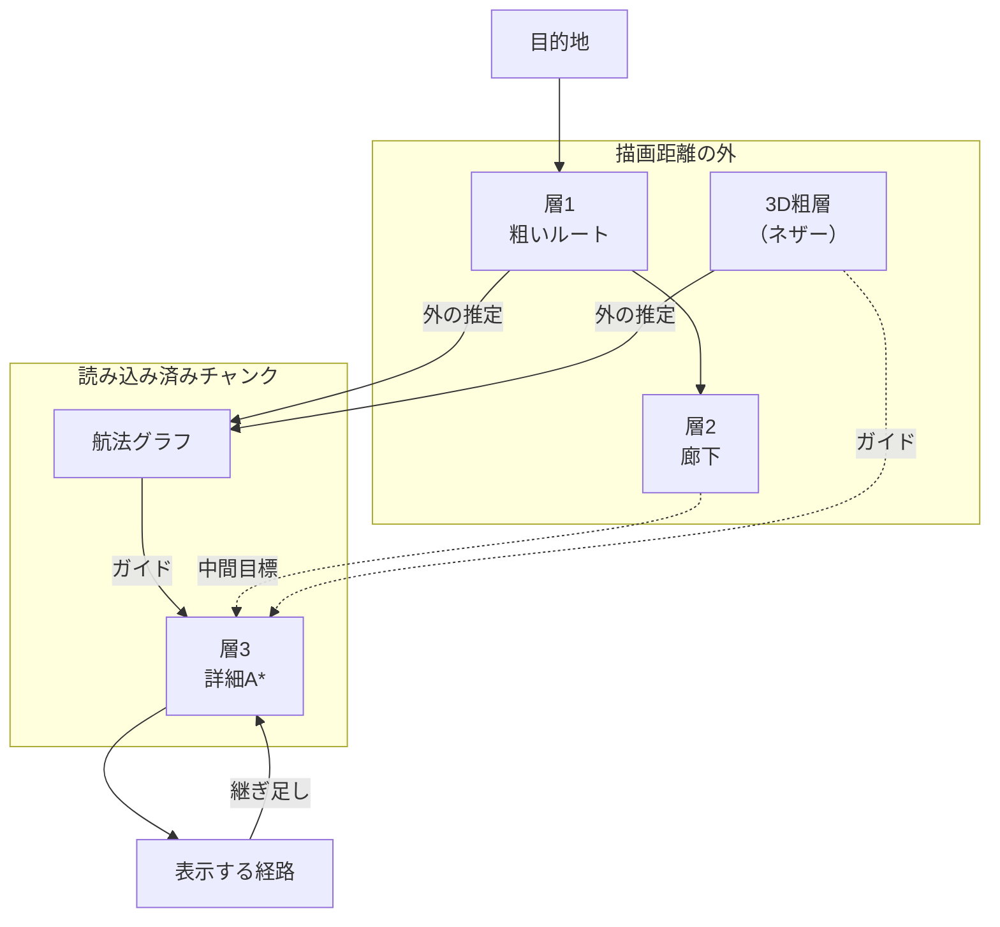
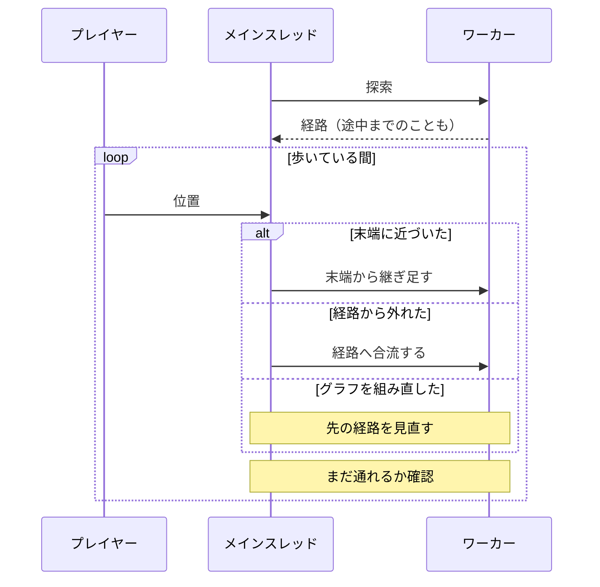

# 経路探索の仕組み

[English](how-routing-works.md) | 日本語

XaeroNav が「実際に歩ける道」をどうやって見つけ、歩いている間どう保つかを説明します。
コードを読まなくても全体が分かることを目標にしています。関係するクラスの名前も本文中に書いています。
数値は現在の既定値です。

## 目次

1. [全体像](#全体像)
2. [なにが難しいのか](#なにが難しいのか)
3. [コストはすべて「時間」](#コストはすべて時間)
4. [詳細探索（A\*）](#詳細探索a)
5. [航法グラフ：読み込み済み範囲の「残りコストの地図」](#航法グラフ読み込み済み範囲の残りコストの地図)
6. [窓の外：粗い層](#窓の外粗い層)
7. [どのガイドを使うか](#どのガイドを使うか)
8. [経路を育てる：継ぎ足し・合流・見直し](#経路を育てる継ぎ足し合流見直し)
9. [詰まったとき](#詰まったとき)
10. [地下から地上へ](#地下から地上へ)
11. [エリトラの空中経路](#エリトラの空中経路)
12. [安全の注釈](#安全の注釈)
13. [コードの地図](#コードの地図)

## 全体像

XaeroNav は、解像度と見える範囲が違う複数の層を組み合わせて経路を引きます。



点線の矢印は、航法グラフが組み上がるまでの代わりの経路です。

役割を一言でまとめると次のとおりです。

| 層 | 見ているもの | 決めること |
|---|---|---|
| 層1 粗いルート | Xaero の地図（訪れた場所すべて） | 海や溶岩湖をどちら回りで避けるか |
| 層2 廊下の精緻化 | Xaero の地表データ（ブロック単位） | 層1の各区間を地形に沿わせる |
| 3D粗層 | Xaero の洞窟レイヤー | ネザーで縦に重なった通路のどれを使うか |
| 航法グラフ | 読み込み済みチャンクの実ブロック | 窓の中のどこからでも、目的地まで最小で何tickかかるか |
| 層3 詳細A\* | 読み込み済みチャンクの実ブロック | 1歩ごとの移動（歩く・掘る・橋を架ける…） |

実際に歩く経路を作るのは層3だけです。ほかの層は層3に「どちらへ向かえばよいか」を教える役です。

## なにが難しいのか

Minecraft で「目的地までの道」を出すには、ふつうの地図アプリにはない壁がいくつかあります。

- **ブロックが読めるのは読み込み済みチャンクだけ。** 描画距離の外は、クライアントからは中身が分かりません。
  1回の探索では、数百ブロック先の目的地まで届きません。
- **プレイヤーは地形を変えられる。** 掘る、ブロックを置いて橋を架ける、泳ぐ、ボートに乗る、梯子を登る、
  隙間を跳ぶ。選べる行動が多いので、探索の分岐も多くなります。
- **同じXZに複数の床がある。** ネザーでは通路が縦に何層も重なります。「地表の高さ」だけで地形を表すと、
  上下に分かれた別々の通路が段差1つで繋がっているように見えてしまいます。
- **ゲームを止めてはいけない。** 探索はワーカースレッドで走ります。一方、チャンクや Xaero の地図は
  メインスレッドからしか読めません。

そこで、遠くは粗い地図で方角だけを決め、近くは実ブロックで正確に解きます。
その間を「航法グラフ」がつなぎ、歩きながら少しずつ経路を先へ伸ばしていきます。

## コストはすべて「時間」

どの層も、経路の良し悪しを **tick**（1/20秒）で測ります。「距離が短い」ではなく「早く着く」経路が良い経路です。
層ごとに単位が揃っているので、粗い層の見積もりと詳細探索の結果をそのまま比べられます。

| 動作 | 1ブロックあたり | 根拠 |
|---|---|---|
| 疾走 | 約3.56 tick | 秒速5.612ブロック |
| 歩き | 約4.63 tick | 秒速4.317ブロック |
| 泳ぎ | 約5.56 tick | 水中移動の速度の漸化式から導いた秒速3.6ブロック |
| ボートで漕ぐ | 2.5 tick | 秒速8ブロック（乗り込む手間は別に払う） |
| 1段登る（ジャンプ） | 約7.63 tick | 跳躍の放物線から計算 |
| 梯子・ツタを登る | 約8.51 tick | |
| 掘る | ブロックと道具しだい | Minecraft 本体の破壊速度計算をそのまま使う |
| 橋を架ける | 設置の手間 + 走りが途切れる分 | |

掘るのは疾走のおよそ7倍、橋はおよそ11倍かかります。このため、歩いて回り込める所では回り込み、
回り込むと大きく遠回りになる所でだけ掘ったり橋を架けたりする経路になります。

コードでは `pathfinding/cost/ActionCosts.java` と `DigCost.java` にあります。

## 詳細探索（A\*）

実際に歩く経路を作る中心の部分です（`AStarPathfinder`）。

### 状態と移動

探索のノードは **足の位置（x, y, z）** です（ボートに乗っているかどうかも区別します）。
各ノードから、次の移動を生成します。

- 歩く（縦横・斜め）、1段登る・降りる（斜めも）、落ちる（水への着水を含む）
- 泳ぐ（水平・浮上・潜降）、ボートを出して漕ぐ
- 梯子・ツタの昇り降り
- 1〜3ブロックの隙間を跳ぶ
- 掘って通る（身体が通る2マスを掘る）
- 足元にブロックを置いて橋を架ける、真上に積んで登る
- 設定で許した場合だけ：痛い落下、着地寸前に水を置く落下（MLG）

掘ってよいのは自然生成の地形ブロックだけです（石・土・砂・鉱石・葉・ネザーラックなど）。
丸石やレンガ、板材、インベントリを持つブロックは掘りません。
橋に使うブロックは **実際に持っている数** を上限にします。それを超える経路は、ほかに道が無いときだけ出します。

### 向かう先の見積もり（ヒューリスティック）

A\* は「ここまでにかかったコスト g」と「ここから目的地までの見積もり h」の和が小さいノードから広げていきます。
h には2種類あり、ノードごとに大きい方を使います。

1. **幾何学的な下限**（`Heuristic`）。水平は斜め移動込みの距離、高さは登りを水平移動に相乗りさせた、
   実コストを絶対に上回らない値です。地形を何も知らないので、山や溶岩湖があるとかなり低く出ます。
2. **ガイド**（`CostToGo`）。地形を知っている層が作った残りコストの表です。航法グラフや層1、3D粗層がこれを作ります。

ガイドが正確なほど、探索は無駄な方向へ広がらず、まっすぐ目的地の方へ伸びます。
[航法グラフ](#航法グラフ読み込み済み範囲の残りコストの地図)は、このガイドを窓の中で「正解」にするための仕組みです。

### 打ち切りと部分経路

- 探索は **展開したノードの数**（既定10万）で打ち切ります。時間で打ち切ると、そのときのマシンの負荷で結果が変わり、
  再計算のたびに線が揺れるからです。時間の上限（2秒）は、異常に重い地形のための安全弁です。
- 航法グラフが無いときは、h に1.5倍の重みを掛けます（weighted A\*）。最短の保証は失いますが、
  同じノード数でずっと遠くまで届きます。航法グラフがあるときは重み1.0で解きます。
  ガイドが正確なので、重みを掛けても速くならず、遠回りが増えるだけだからです。
- 目的地に届かなかったときは、「ここまで行けば一番有望」という途中の点までの **部分経路** を返します。
  目的地に近いだけの行き止まり（崖の縁など）を選ばないよう、「目的地への近さ」と「実際に進んだ量」を
  複数の比率で採点します。1区間で賭けてよいコストにも上限があります。
- 平地で線がL字や階段にならないよう、コストがほぼ同じ（差が2tick未満）ノードの間でだけ、始点と目的地を結ぶ直線に近いものを先に取り出します。
  地形を避けるための本当のコスト差には干渉しません。

## 航法グラフ：読み込み済み範囲の「残りコストの地図」

航法グラフは、窓の中の **すべての立ち位置について「目的地まで最小で何tickかかるか」** をあらかじめ計算した表です
（`NavGraph` / `WindowField`、管理は `client/NavGraphGuide`）。これがガイドになると、窓の中では
探索が迷わず最短の方向へ進みます。

### 窓

```
   +-------------------------------------------+
   | 120 115 110 105 100  95  90  85  80  75   |  <- 立てるマスごとに
   | 118 113 108 103  98  93  88  83  78  73   |     「目的地まで何tick」
   | 116 111 106 101  @   91  86  81  76  71 --+--> 縁には窓の外の推定を置く
   | 118 113 108 103  98  93  88  83  78  73   |          ... * 目的地
   | 120 115 110 105 100  95  90  85  80  75   |     （窓の外でもよい）
   +-------------------------------------------+
     @ = プレイヤー。窓は @ から各方向に224ブロック
```

図の数字は「そのマスから目的地まで最小で何tickか」のイメージです。探索は数字が小さくなる方へまっすぐ進めます。

- 窓はプレイヤーを中心とした正方形です。半径は既定で224ブロックで、描画距離の方が狭ければそちらに合わせます。
  Java ヒープの上限が2.5GB未満のときは160ブロックに縮めます（グラフとガイドで最大約610MB使うため。160なら約330MB）。
- 詳細探索の箱も同じ窓で切ります。窓の外ではガイドが推定に落ちるので、箱と窓がずれないようにしています。

### 組み立て方

1. **16×16×16 のセクションごとに組む。** 各セクションの中で、**層3とまったく同じ移動生成**を使って辺（移動とそのコスト）を列挙します。
   別のコストモデルで作ったグラフは「別の推測」でしかありません。同じ移動から作るので、ガイドの値が探索にとっての本物の残りコストになります。
2. **殻だけを持つ。** 窓の中の全セルを持つと辺が数千万本になります。その大半は岩の中や空中です。
   そこで、「掘らず・置かずに立てる高さ」（水は全深さ）から水平8・垂直2ブロック以内のセルだけをグラフに入れます。
   奈落や溶岩の海を渡る橋が通りうる列は、殻が届かなくても足します。
3. **目的地から逆向きにDijkstraする。** 辺を逆にたどって、目的地から各ノードまでの最小コストを広げます（整数バケットのDial法）。
4. **窓の縁に「外の推定」を置く。** 目的地が窓の外にあるとき、窓の縁や窓の外へ出る辺の先に、外から目的地までの推定値を置いて種にします。

| 次元 | 窓の外の推定 |
|---|---|
| 現世（Xaero の地図あり） | 層1の残りコスト |
| ネザー | 3D粗層の残りコスト×1.3（3D粗層は真の値の0.77倍前後に縮むため） |
| エンド／地図なし | 目的地までの直線距離（目的地が窓の外にあるときだけ） |

分からない場所は **無限大（不明）** にします。質の悪い推定を置くと、何も置かないより経路が悪くなるからです。
エンドで層1を窓の縁に置くと、直線距離だけのときより悪くなることが測定で分かっています。

### 使い方の決まり

- **グラフに無い点で0を返さない。** 掘ったり置いたりして生まれた立ち位置はグラフにありません。
  そこで0を返すと探索がそこへ吸い寄せられます。近く（3ブロック以内）のノードの値から延ばし、
  それも無ければ外の推定か幾何学的な下限を使います。
- **目的地が殻に繋がっていなければ使わない。** 窓の中の値がすべて縁の推定から来てしまい、尺度が合わないためです。
- **8ブロック歩くごとに組み直す。** セクションは目的地ごとに覚えておき、新しく窓に入った帯だけを並列に組み足します。
  組み直している間は古いガイドで探索を続けます。チャンクの中身が変わったら、その周りのセクションを捨てて組み直します。
- **最初の経路は少し待つ。** まだ経路が1本も無く、目的地が遠いときは、グラフができるまで最大10秒待ってから最初の経路を引きます。
  近い目的地は待たずにすぐ解きます。待ちきれずに引いた経路も、あとでグラフができたら見直しの対象になります。
- 組み立てに失敗したら（メモリ不足など）、30秒は組み直さず、その間は従来の探索で案内を続けます。

設定 `costToGoGuideEnabled = false` にすると、航法グラフと、読み込み済みの範囲から作る層1の見積もりを使わなくなり、
ガイドは幾何学的な下限だけになります。中間目標とネザーの3D粗層は引き続き使います。

### 効果

実際の地形データで「歩き通したら何tickかかるか」を、全部が見えているときの最短と比べた値（平均／最悪）:

| 地形 | 航法グラフなし | 航法グラフあり |
|---|---|---|
| 現世の広域・長距離 | 1.067 / 1.165倍 | 1.016 / 1.030倍 |
| エンド | 1.122倍 / 到達できない1本 | 1.013 / 1.029倍 |
| ネザー | 1.048 / 1.104倍（3D粗層のみ） | 1.013 / 1.023倍 |

（窓160での測定。窓224ではネザーと現世でさらに縮みます。詳細は [ADR-001](architecture/001-route-pipeline.md)。）

## 窓の外：粗い層

窓の外は実ブロックが読めないので、Xaero が保存している地図データから粗い地形を作って方角を決めます。
Xaero の地図が無い場所（未訪問の土地、Xaero 未導入）では使えません。そのときは読み込み済みの範囲だけで案内します。

### 層1：粗いルート（`CoarseRouter`）

- Xaero の地図を **1チャンク＝1セル** に潰した粗い地図（`CoarseMap`）の上で解きます。セルは地形の種類と高さを持ち、
  ネザーのように床が重なる場所では1セルに最大6枚の床を持ちます。
- 状態は `(チャンクX, チャンクZ, 床)` です。別の床へ移る辺には専用のコストを付けます。
  重なった床を「安い段差」でつないでしまわないためです。
- 地図に無いチャンクは通れないとは決めつけず、既知の陸の1.6倍のコストにします。未踏の土地を挟む目的地にも
  ルートは出ますが、既知の迂回路が多少遠くてもそちらを優先します。
- 結果は4チャンク（64ブロック）ごとの **中間目標の列** です。地図とHUDの点線にもなります。

### 層2：廊下の精緻化（`CorridorLegSolver`）

層1の各区間を、±48ブロックの廊下に切ります。その中を Xaero の **ブロック単位の地表データ** で解き直し、
24ブロック間隔の中間目標にします。地表データには洞窟・張り出し・木の天蓋・建物が映らないので、
細かい誤りは層3が現地で直します。

### 中間目標は「通る場所」ではなく「向かう方角」

航法グラフが使えないとき、層3は中間目標を狙います。このとき中間目標は **半径付きの領域** として扱います
（層1・層2の点は6ブロック、直線上の補間点は16ブロック）。高さも大きく緩めます。
人工的な点へぴったり寄せようとすると、その分の遠回りが経路に乗ってしまうからです。
ユーザーが指した目的地だけは半径0で、座標そのものを狙います。

### 3D粗層：ネザー用（`VoxelTerrain` / `VoxelCostToGo`）

ネザーでは層1が役に立ちません。チャンクごとに床を数枚持つだけの表現では、縦に積まれたトンネルを区別できないからです。
そこでネザー（天井のある次元）だけは、Xaero の洞窟レイヤーから **4ブロック角の3次元格子** を作り、
目的地から逆向きに残りコストを計算します。

- 床が分かっているセルは「立てる」、それ以外は「空洞かもしれない（通れる）」として扱います。
  知らない所を壁にすると、地図の無い迂回路ごと消えてしまうためです。
- 探索の箱の外まで覆うので、遠い目的地でも方角を示せます。
- 組むのに最大1秒ほどかかるので、目的地が変わったとき、箱から出かかったとき、128ブロック歩いたとき、探索が進めなかったときにだけ組み直します。

## どのガイドを使うか

層3が **どこを狙い、何をガイドにするか** は、次のように決まります。

| 状況 | 狙う先 | ガイド | 重み |
|---|---|---|---|
| 航法グラフができている（全次元） | 最終目的地 | 航法グラフ | 1.0 |
| 航法グラフがまだ・使えない、空のある次元 | 層1・層2の中間目標（地図が無ければ目的地の方向の点） | 読み込み済みチャンクから組んだ粗い見積もり（狙う先が探索の箱の中にあるとき） | 設定値（既定1.5） |
| 航法グラフがまだ・使えない、ネザー | 最終目的地 | 3D粗層（Xaero が無ければ、読み込み済みチャンクから組んだ粗い見積もりか幾何学的な下限） | 設定値（既定1.5） |
| 現世・エンドで Xaero の地図が無い | 最終目的地 | 航法グラフ（窓の外は直線距離） | 1.0 |

ネザーでは、3D粗層ができるまで航法グラフを使いません。窓の外が直線距離のままだと、3D粗層だけのときより悪くなるからです。

航法グラフで直接目的地を狙うときも、層1は引き続き引きます。地図とHUDの点線、窓の外の推定に使います。

## 経路を育てる：継ぎ足し・合流・見直し

1回の探索で目的地まで届かないのが普通です。そこで、出した経路を歩きながら少しずつ育てます（`client/PathfindingState` ほか）。



- **継ぎ足し**（`Extend`）: 経路の末端に近づいたら、プレイヤーからではなく **末端から** 次の区間を探します。
  手前は定義上変わらないので、足元の線がちらつきません。
- **合流**（`Splice`）: 経路から外れても、すぐに全部を引き直しはしません。いまの位置から経路上の近い点へ戻る短い探索
  （最大3万ノード）を先に試します。橋や掘削を含む高価な経路をそのまま使い続けられます。
- **繋ぎ目の解き直し**（`SeamRepair`）: 区間と区間の境目には角が残りがちです。前後が揃った時点で、境目をまたぐ区間だけを解き直し、
  安くなるなら差し替えます。
- **見直し**（`RouteReview`）: 窓が進んで、それまで推定だった場所が正確になると、「北へ行く方が近かった」と分かることがあります。
  航法グラフを組み直すたびに、先の経路の値段とガイドの値を比べます。40tick以上かつ5%以上の遠回りだと分かったら引き直します。
- **検証**（`PathValidator`）: 定期的に経路上のセルだけを読み直し、塞がった・溶岩が流れ込んだなどで通れなくなっていないか確かめます。
  探索と同じ判定を使うので、「探索は通したのに検証が落とす」という食い違いが起きません。
- **詰みの判定**（`StuckTracker`）: 「目的地へ行けません」と表示するのは、ほぼ同じ場所から投げた探索が4回続けて、
  狙った先にも届かず目的地にも近づかなかったときだけです。遠ざかりながら正しく迂回している最中を詰みと誤判定しないためです。

## 詰まったとき

通常の探索で届かなかったら、段階的に手を広げます（`PathfindingExecutor`）。

1. **深い予算を並列に。** 初回の探索は、通常予算（10万ノード）と深い予算（8倍、最大30秒）を同時に走らせます。
   通常予算で届けば深い方は即座に止めます。直列にすると、2回分の時間がそのまま足し算になるからです。
2. **箱を広げる。** 通常の余白で届かなかった目標には、描画距離いっぱいまで箱を広げて再挑戦します。
3. **粗い経由地チェーン。** 読み込み済みチャンクから粗い地図をその場で作り、区間に分けて順に解きます。
4. **危険の許容量を緩める。** それでも道が無いときだけ、次の順に上限を緩めます。
   - 持ち物のブロック数の上限を外す → ブロックを持っていなくても橋を出す（HUDが不足数を伝えます）
   - 橋の連続長・潜水時間の上限を2倍 → 4倍 → 無制限
   - 奈落の上の跳躍は、これを全部試してからようやく許可
   - 痛い落下は、設定で許可している場合に限り、体力の半分まで

緩めて出した経路は、危険な区間に警告色が付きます。

## 地下から地上へ

地下にいて目的地が地上にある場合は、目的地の真下へまっすぐ掘り進むのではなく、
まず **近くの洞窟の出口や崖** から地上へ出る経路を引きます（`searchToSurface`）。
ゴールを1点ではなく「空の見える一定の高さ以上ならどこでも」とします。
ネザーとエンドには空が無いので、この動作はしません。

## エリトラの空中経路

滑空を始めると、徒歩とは別の探索に切り替わります（`pathfinding/flight`）。

- 空間を **6ブロック角の格子**（`flightCellBlocks`）に区切り、中身が完全に空いているセルだけを飛べるものとします。
  格子の粗さそのものが、壁との余白になります。
- 格子の上を26近傍のA\*で解きます。コストはエリトラの物理から見積もります。滑空では水平に進む分だけ高度をただで下げられるので、そこも値段に入っています。
- 描画距離の外は、Xaero の地図から作った粗い空中地図（高度帯ごと）で方角を決めます。
- 格子の階段状の線を、通せる限りまっすぐに伸ばします（string pull）。狭い隙間しか無くて解けなければ、格子を半分の細かさにして解き直します。
- 目的地の近くまで来て着地すると、同じ目的地への徒歩の案内に戻ります。

## 安全の注釈

コストはあくまで事前の見積もりです。そこで、経路を出す直前に、掘る区間などを改めて点検して色を付けます（`PathSafetyChecker`）。
溶岩の隣、掘ると水が流れ込む、足元が奈落、息が続かない潜水、痛い落下などです。
この点検は探索のコストには影響させず、結果への注釈として分けています。色の意味は [README](../README.ja.md#経路の色) を見てください。

## コードの地図

| 役割 | 場所 |
|---|---|
| 詳細A\*・移動生成 | `pathfinding/astar/AStarPathfinder.java`, `GroundMoves`, `WaterMoves`, `BuildMoves` |
| コスト | `pathfinding/cost/ActionCosts.java`, `DigCost.java` |
| ブロックの読み取り | `pathfinding/world/CellSource.java`（本番は `ChunkView`、テストは `FakeCells`） |
| 航法グラフ | `pathfinding/navgraph/NavGraph.java`, `WindowField.java`, `SectionShell.java`, `client/NavGraphGuide.java` |
| 層1・3D粗層 | `pathfinding/coarse/CoarseRouter.java`, `CoarseMap.java`, `VoxelTerrain.java`, `VoxelCostToGo.java` |
| 層2 | `pathfinding/corridor/CorridorLegSolver.java` |
| 非同期実行・再挑戦 | `pathfinding/async/PathfindingExecutor.java` |
| 状態機械・継ぎ足し・合流 | `client/PathfindingState.java`, `Extend.java`, `Splice.java`, `SeamRepair.java`, `PathValidator.java` |
| 空中経路 | `pathfinding/flight/` |

設計の約束事（変えてはいけない不変条件と、それを守るテスト）は
[アーキテクチャ判断記録](architecture/README.md) にまとめています。

うまくいかない経路を見つけたら、その場で `/xaeronav debug probe <x> <y> <z>` を実行し、出力を添えて
[issue](https://github.com/Narcissus-tazetta/XaeroNav/issues/new/choose) を立ててください。
探索がどこまで届き、なぜ止まったかが分かります。
