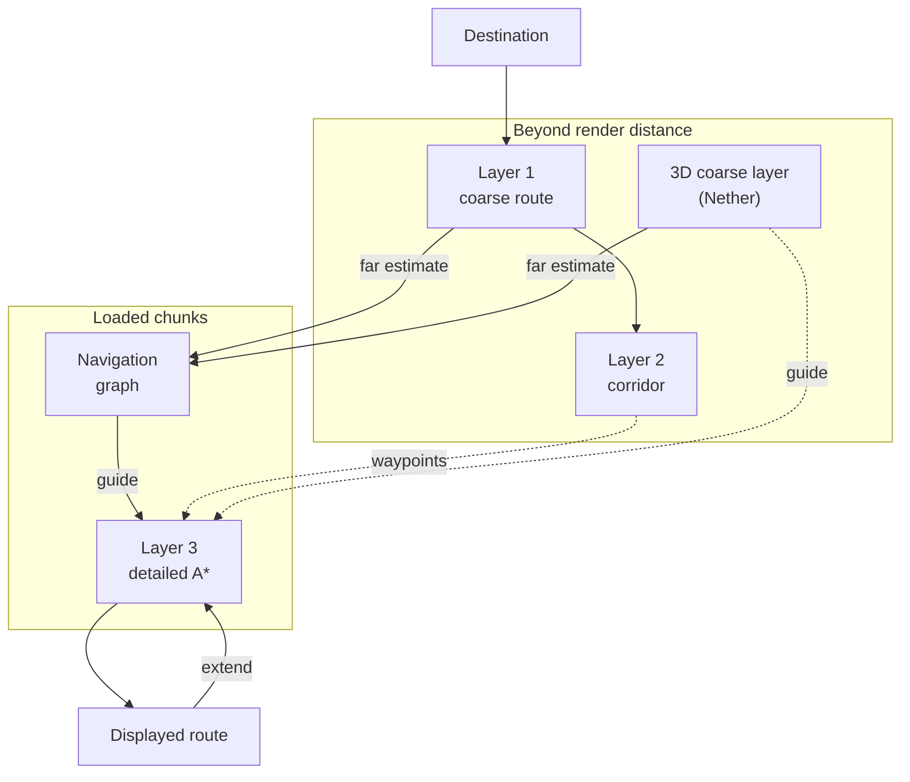
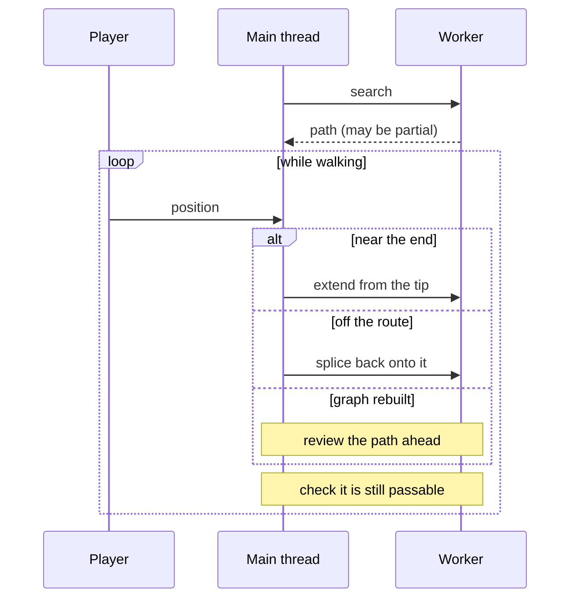

# How routing works

English | [日本語](how-routing-works.ja.md)

This page explains how XaeroNav finds a route you can actually walk, and how it keeps that route
working while you move. It is meant to be readable without opening the code; the classes involved
are named in the text. Numbers are the current defaults.

## Contents

1. [The big picture](#the-big-picture)
2. [What makes this hard](#what-makes-this-hard)
3. [Every cost is time](#every-cost-is-time)
4. [The detailed search (A\*)](#the-detailed-search-a)
5. [The navigation graph: a cost map of the loaded area](#the-navigation-graph-a-cost-map-of-the-loaded-area)
6. [Beyond the window: the coarse layers](#beyond-the-window-the-coarse-layers)
7. [Which guide is used when](#which-guide-is-used-when)
8. [Growing the route: extend, splice, review](#growing-the-route-extend-splice-review)
9. [When the search gets stuck](#when-the-search-gets-stuck)
10. [Getting out from underground](#getting-out-from-underground)
11. [Elytra routes](#elytra-routes)
12. [Safety annotations](#safety-annotations)
13. [Code map](#code-map)

## The big picture

XaeroNav combines several layers, each with a different resolution and a different view of the world.



Dotted arrows are the fallback used until the navigation graph is ready.

In one line each:

| Layer | Looks at | Decides |
|---|---|---|
| Layer 1: coarse route | Xaero's map (everywhere you have been) | Which way around a sea or lava lake |
| Layer 2: corridor refinement | Xaero's surface data, per block | How each Layer 1 leg follows the terrain |
| 3D coarse layer | Xaero's cave layers | Which of the Nether's stacked tunnels to use |
| Navigation graph | Real blocks in loaded chunks | From any spot in the window, the cheapest cost to the destination |
| Layer 3: detailed A\* | Real blocks in loaded chunks | Every single move: walk, dig, bridge, ... |

Only Layer 3 produces the path you walk. Every other layer exists to tell Layer 3 which way to head.

## What makes this hard

Routing in Minecraft runs into problems an ordinary map app never has:

- **Blocks are only readable in loaded chunks.** Beyond render distance the client has no idea what
  is there, so a single search cannot reach a destination hundreds of blocks away.
- **The player can change the terrain.** Digging, bridging, swimming, boats, ladders, jumping gaps:
  the move set is large, and so is the branching.
- **Several floors can share the same XZ.** Nether tunnels stack vertically. Describing terrain by a
  single surface height makes separate tunnels look like they are joined by one step.
- **The game must not freeze.** Searches run on worker threads, but chunks and Xaero's map can only
  be read from the main thread.

So the far distance is handled by coarse maps that only pick a direction, the near distance is
solved exactly on real blocks, the navigation graph bridges the two, and the route is extended piece
by piece as you walk.

## Every cost is time

Every layer measures a route in **ticks** (1/20 of a second). The best route is the one that gets
you there soonest, not the shortest one. Because every layer uses the same unit, a coarse estimate
can be compared directly with what the detailed search found.

| Action | Per block | Where it comes from |
|---|---|---|
| Sprint | ~3.56 ticks | 5.612 blocks/s |
| Walk | ~4.63 ticks | 4.317 blocks/s |
| Swim | ~5.56 ticks | 3.6 blocks/s, derived from the game's water movement recurrence |
| Paddle a boat | 2.5 ticks | 8 blocks/s (getting in is paid separately) |
| Step up one block (jump) | ~7.63 ticks | from the jump's parabola |
| Climb a ladder or vine | ~8.51 ticks | |
| Dig | depends on block and tool | uses Minecraft's own break-speed calculation |
| Bridge | placing time + lost sprint | |

Digging costs roughly 7× sprinting and bridging roughly 11×. That is why routes walk around
obstacles when they reasonably can, and only dig or bridge where going around would be a large
detour.

Code: `pathfinding/cost/ActionCosts.java`, `DigCost.java`.

## The detailed search (A\*)

This is the part that produces the actual path (`AStarPathfinder`).

### States and moves

A search node is **where your feet are (x, y, z)**, plus whether you are in a boat. From each node
the search generates:

- walking (straight and diagonal), stepping up or down (also diagonally), falling (including into water)
- swimming (level, up, down), launching and paddling a boat
- climbing ladders and vines
- jumping gaps of 1 to 3 blocks
- digging through (the two cells your body passes)
- placing a block underfoot to bridge, or pillaring straight up
- only when enabled in the config: falls that deal damage, and water-bucket (MLG) landings

Only naturally generated terrain is dug (stone, dirt, sand, ores, leaves, netherrack, ...). Cobblestone,
bricks, planks and anything with an inventory are left alone. Bridging is capped by **the number of
blocks you actually carry**; a route that needs more is only offered when there is no other way.

### Estimating what is left (the heuristic)

A\* expands the node with the smallest sum of "cost so far" (g) and "estimated cost to go" (h). Two
estimates exist, and each node uses the larger one:

1. **A geometric lower bound** (`Heuristic`): diagonal-aware horizontal distance, with climbing folded
   into horizontal steps where it can be. It never exceeds the real cost, but it knows nothing about
   terrain, so it runs very low next to mountains or lava lakes.
2. **A guide** (`CostToGo`): a table of remaining cost built by a layer that does know the terrain —
   the navigation graph, Layer 1, or the 3D coarse layer.

The more accurate the guide, the less the search wanders and the more directly it grows toward the
destination. The [navigation graph](#the-navigation-graph-a-cost-map-of-the-loaded-area) exists to
make that guide exact inside the window.

### Budgets and partial paths

- A search stops after a fixed number of **expanded nodes** (100,000 by default). Stopping on time
  would make the result depend on how busy the machine is, and the line would change on every
  recalculation. The 2-second time limit is only a safety valve for pathological terrain.
- Without the navigation graph, h is weighted by 1.5 (weighted A\*). That gives up the shortest-path
  guarantee but reaches much farther for the same node budget. With the navigation graph the weight
  is 1.0: the guide is already exact, so weighting it only adds detours without making the search faster.
- If the destination is not reached, the search returns a **partial path** to the most promising
  point. To avoid picking a dead end that merely happens to be close (a cliff edge), candidates are
  scored on several mixes of "how close to the goal" and "how far it actually got", and there is a
  cap on how much cost one leg may gamble.
- On flat ground, ties are broken toward the straight line from start to goal, so the route does not
  come out as an L or a staircase. Only near-ties (within 2 ticks) are reordered; real cost
  differences are never overridden.

## The navigation graph: a cost map of the loaded area

The navigation graph is a precomputed table that holds, **for every standable spot in the window,
the cheapest cost in ticks to the destination** (`NavGraph` / `WindowField`, managed by
`client/NavGraphGuide`). Used as the guide, it lets the search head straight down the cheapest
direction inside the window.

### The window

```
   +-------------------------------------------+
   | 120 115 110 105 100  95  90  85  80  75   |  <- every standable cell holds
   | 118 113 108 103  98  93  88  83  78  73   |     "ticks left to the goal"
   | 116 111 106 101  @   91  86  81  76  71 --+--> edge seeded with the
   | 118 113 108 103  98  93  88  83  78  73   |     far-field estimate
   | 120 115 110 105 100  95  90  85  80  75   |          ... * goal
   +-------------------------------------------+               (may be outside)
     @ = player. The window reaches 224 blocks from @ in each direction.
```

The numbers illustrate "cheapest ticks from here to the goal". The search simply follows them downhill.

- The window is a square centered on the player, reaching 224 blocks in each direction, or less if
  your render distance is shorter. If the Java heap limit is below 2.5 GB it shrinks to 160 blocks
  (the graph and guide can take up to about 460 MB at 224, about 260 MB at 160).
- The detailed search's bounding box is cut to the same window. Outside the window the guide falls
  back to an estimate, so the box and the window are kept aligned.

### How it is built

1. **Per 16×16×16 section.** Inside each section, edges (moves and their costs) are generated by
   **exactly the same move generator as Layer 3**. A graph built on a different cost model would just
   be another guess; built from the same moves, its values are the true remaining cost as the search
   sees it.
2. **Only a shell is kept.** Keeping every cell in the window would mean tens of millions of edges,
   most of them inside rock or in mid-air. The graph keeps cells within 8 blocks horizontally and 2
   vertically of a spot you can stand on without digging or placing (water counts at every depth).
   Columns a bridge could cross over a chasm or lava sea are added even beyond that shell.
3. **Reverse Dijkstra from the destination.** Edges are followed backward to spread the cheapest cost
   from the destination to every node (Dial's algorithm with integer buckets).
4. **Seed the edge with a far-field estimate.** When the destination is outside the window, the
   window's rim and the ends of edges leaving it are seeded with an estimate of the cost from there
   to the destination.

| Dimension | Estimate outside the window |
|---|---|
| Overworld with Xaero's map | Layer 1 cost-to-go |
| Nether | 3D coarse layer cost-to-go × 1.3 (that layer runs at about 0.77× the true value) |
| End, or no map | Straight-line distance, only while the destination is outside the window |

Anything unknown is **infinite**. A poor estimate is worse than none: in the End, seeding the rim with
Layer 1 measured worse than straight-line distance alone.

### Rules for using it

- **Never return 0 for a point that is not in the graph.** Spots created by digging or placing are not
  in the graph. Returning 0 there would pull the search toward them. Instead the value is extended
  from nearby nodes (within 3 blocks), then from the far-field estimate or the geometric bound.
- **Do not use it if the destination is not connected to the shell.** Every value in the window would
  then come from the rim estimate, on a scale that does not match.
- **Rebuild every 8 blocks walked.** Sections are remembered per destination and only the newly
  uncovered strip is built, in parallel. Searches keep using the previous guide until the new one is
  ready. When a chunk's blocks change, the sections around it are dropped and rebuilt.
- **Wait briefly for the first route.** When nothing has been drawn yet and the destination is far,
  the first route waits up to 10 seconds for the graph. Near destinations are solved immediately. A
  route drawn without the graph is reviewed once the graph is ready.
- If building fails (for example, out of memory), it is not retried for 30 seconds and guidance
  continues without it.

Setting `costToGoGuideEnabled = false` turns off the navigation graph and the Layer 1 estimate built
from loaded chunks, leaving the geometric bound as the only guide. Waypoints and the Nether's 3D
coarse layer are still used.

### What it buys

Walking time over real terrain data, compared with the best route found when everything is visible
(mean / worst):

| Terrain | Without the graph | With the graph |
|---|---|---|
| Overworld, wide area, long distance | 1.067 / 1.165× | 1.016 / 1.030× |
| The End | 1.122× / one route never arrives | 1.013 / 1.029× |
| Nether | 1.048 / 1.104× (3D coarse layer only) | 1.013 / 1.023× |

(Measured with a 160-block window; the 224-block window is tighter still in the Nether and the
Overworld. Details in [ADR-001](architecture/001-route-pipeline.md).)

## Beyond the window: the coarse layers

Outside the window there are no blocks to read, so a direction is picked from coarse terrain built
out of the map data Xaero keeps on disk. Where there is no map data (unvisited land, or Xaero not
installed), these layers are unavailable and guidance works from loaded chunks only.

### Layer 1: coarse route (`CoarseRouter`)

- Solved on a coarse map (`CoarseMap`) with **one cell per chunk**. Each cell stores terrain kind and
  height, and in places where floors stack, like the Nether, up to 6 floors per cell.
- The state is `(chunkX, chunkZ, floor)`. Moving to another floor is its own edge with its own cost,
  so stacked floors are never joined as if they were a cheap step.
- Chunks missing from the map are not treated as walls; they cost 1.6× known land. A destination
  across unvisited land still gets a route, but a known detour wins if it is only somewhat longer.
- The output is a **chain of waypoints**, one every 4 chunks (64 blocks). It is also the dotted line
  on the map and the HUD.

### Layer 2: corridor refinement (`CorridorLegSolver`)

Each Layer 1 leg is cut into a corridor ±48 blocks wide and re-solved on Xaero's **per-block surface
data**, producing waypoints every 24 blocks. Surface data cannot see caves, overhangs, tree canopies
or buildings, so Layer 3 corrects the remaining mistakes on the spot.

### Waypoints are directions, not places

When the navigation graph is unavailable, Layer 3 aims at these waypoints — as **areas with a radius**
(6 blocks for Layer 1/2 waypoints, 16 for points interpolated along a line), with height loosened even
more. Forcing the path through an artificial point exactly would add a detour for no reason. Only the
destination you picked is aimed at exactly.

### The 3D coarse layer, for the Nether (`VoxelTerrain` / `VoxelCostToGo`)

In the Nether Layer 1 does not help: a few floors per chunk column cannot tell stacked tunnels apart.
So in dimensions with a ceiling, Xaero's cave layers are turned into a **3D grid of 4-block cells**,
and the remaining cost is computed backward from the destination.

- Cells with a known floor are "standable"; every other cell is "maybe open" and passable. Treating the
  unknown as solid would erase detours that the map has not seen yet.
- It covers well beyond the search box, so it can point the way to far destinations.
- Building it takes up to about a second, so it is rebuilt only when the destination changes, when
  you are about to leave its box, after 128 blocks of walking, or when a search failed to make progress.

## Which guide is used when

Where Layer 3 aims and what it uses as its guide:

| Situation | Aims at | Guide | Weight |
|---|---|---|---|
| Navigation graph ready (any dimension) | The destination | Navigation graph | 1.0 |
| Overworld or End without Xaero's map | The destination | Navigation graph (straight line outside) | 1.0 |
| No graph yet or unusable, dimension with sky | Layer 1/2 waypoints (a point toward the destination without a map) | Coarse estimate built from loaded chunks (when the target is inside the search box) | config (1.5) |
| No graph yet or unusable, Nether | The destination | 3D coarse layer (without Xaero, the coarse estimate from loaded chunks or the geometric bound) | config (1.5) |

In the Nether the navigation graph waits for the 3D coarse layer: with only a straight line outside
the window, it did worse than the 3D coarse layer alone.

Even when the graph aims straight at the destination, Layer 1 is still computed, for the dotted line
on the map and HUD and for the estimate outside the window.

## Growing the route: extend, splice, review

A single search usually does not reach the destination, so the route is grown while you walk
(`client/PathfindingState` and friends).



- **Extend** (`Extend`): near the end of the path, the next leg is searched **from the tip**, not from
  the player. The part already in front of you never changes, so the line under your feet stays still.
- **Splice** (`Splice`): stepping off the route does not throw it away. A short search back to a nearby
  point on the route (at most 30,000 nodes) is tried first, so an expensive route with bridges and
  digging can be kept.
- **Seam repair** (`SeamRepair`): legs solved separately leave corners at the joins. Once both sides
  exist, only the span across the join is re-solved, and swapped in if it is cheaper.
- **Review** (`RouteReview`): as the window moves, places that were only estimated become exact, and it
  can turn out that heading north would have been shorter. Each time the graph is rebuilt, the cost of
  the path ahead is compared with the guide; a detour of 40 ticks and 5% or more triggers a replan.
- **Validation** (`PathValidator`): at intervals, only the cells along the path are re-read to check
  nothing has blocked it or flowed into it (such as lava). It uses the same checks as the search, so
  the validator never rejects a path the search considered valid.
- **Stuck detection** (`StuckTracker`): "cannot reach the destination" is shown only after 4 searches
  from roughly the same place neither reached their target nor got closer to the destination. A long
  detour that moves away from the goal while making correct progress is not mistaken for being stuck.

## When the search gets stuck

If a normal search does not get there, the search widens step by step (`PathfindingExecutor`):

1. **A deep budget in parallel.** The first search runs the normal budget (100,000 nodes) and a deep
   one (8×, up to 30 seconds) at the same time. If the normal one arrives, the deep one is cancelled.
   Running them one after the other would add their times together.
2. **A wider box.** A target not reached with the normal margin is retried with the box widened to the
   full render distance.
3. **A coarse waypoint chain.** A coarse map is built on the spot from loaded chunks and the route is
   solved leg by leg.
4. **Loosen the safety limits**, only when there is still no way through, in this order:
   - drop the carried-blocks budget, then allow bridges even with no blocks at all (the HUD shows how many are missing)
   - double, then quadruple, then remove the limits on bridge length and time underwater
   - only after all of that, allow jumps over the void
   - falls that deal damage, only if enabled in the config, up to half your health

Routes found this way mark their risky stretches with warning colors.

## Getting out from underground

When you are underground and the destination is on the surface, the route first heads for a nearby
**cave mouth or cliff** instead of digging straight up under the target (`searchToSurface`). The goal
becomes "anywhere at or above a given height with open sky" rather than a single point. The Nether and
the End have no sky, so this does not apply there.

## Elytra routes

Once you start gliding, a separate search takes over (`pathfinding/flight`):

- Space is split into **6-block cells** (`flightCellBlocks`), and only cells that are completely empty
  are flyable. The coarseness itself becomes clearance from walls.
- A\* runs over those cells with 26 neighbors. Costs come from elytra physics: a glide gets to lose
  height for free in proportion to the horizontal distance it covers.
- Beyond render distance, a coarse air map built from Xaero's map (per altitude band) picks the direction.
- The staircase from the grid is pulled into straight segments wherever they fit (string pulling). If
  only a tight gap exists and nothing is found, the grid is halved and solved again.
- After you touch down near the destination, walking guidance to the same destination takes over again.

## Safety annotations

Costs are estimates made up front, so just before a route is shown, its stretches are checked again
and colored (`PathSafetyChecker`): next to lava, digging that lets water in, a void below, a swim
longer than your breath, a painful fall. These checks do not change the search's costs; they are
annotations on the result. See [Route colors in the README](../README.md#route-colors) for what each
color means.

## Code map

| Role | Where |
|---|---|
| Detailed A\* and move generation | `pathfinding/astar/AStarPathfinder.java`, `GroundMoves`, `WaterMoves`, `BuildMoves` |
| Costs | `pathfinding/cost/ActionCosts.java`, `DigCost.java` |
| Reading blocks | `pathfinding/world/CellSource.java` (`ChunkView` in game, `FakeCells` in tests) |
| Navigation graph | `pathfinding/navgraph/NavGraph.java`, `WindowField.java`, `SectionShell.java`, `client/NavGraphGuide.java` |
| Layer 1 and the 3D coarse layer | `pathfinding/coarse/CoarseRouter.java`, `CoarseMap.java`, `VoxelTerrain.java`, `VoxelCostToGo.java` |
| Layer 2 | `pathfinding/corridor/CorridorLegSolver.java` |
| Async execution and retries | `pathfinding/async/PathfindingExecutor.java` |
| State machine, extend, splice | `client/PathfindingState.java`, `Extend.java`, `Splice.java`, `SeamRepair.java`, `PathValidator.java` |
| Elytra routes | `pathfinding/flight/` |

The design contracts — the invariants that must not break and the tests that guard them — are in the
[architecture decision records](architecture/README.md).

If you find a route that goes wrong, run `/xaeronav debug probe <x> <y> <z>` where it happens and
[open an issue](https://github.com/Narcissus-tazetta/XaeroNav/issues/new/choose) with the output. It
shows how far the search got and why it stopped.
